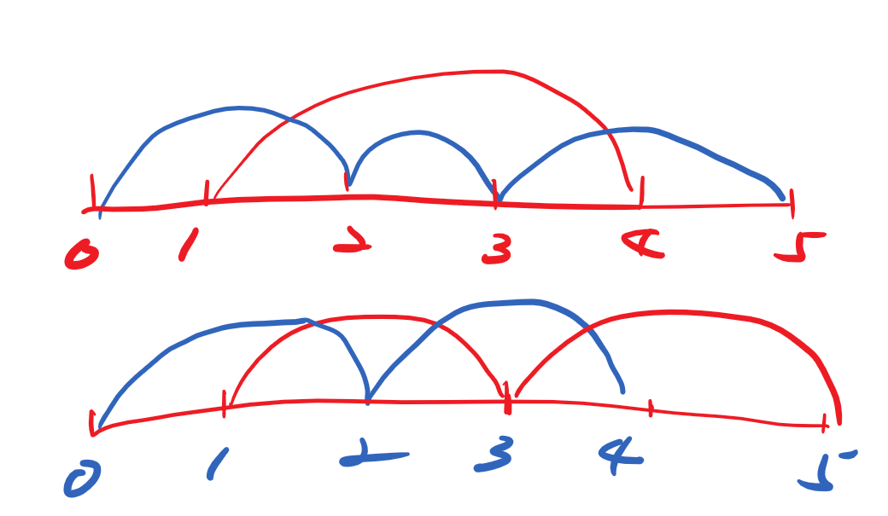

# 2498 Frog Jump II
[原题链接](https://leetcode.com/problems/frog-jump-ii/)

### __Problem__
You are given a 0-indexed integer array stones sorted in strictly increasing order representing the positions of stones in a river.

A frog, initially on the first stone, wants to travel to the last stone and then return to the first stone. However, it can jump to any stone at most once.

The length of a jump is the absolute difference between the position of the stone the frog is currently on and the position of the stone to which the frog jumps.

More formally, if the frog is at `stones[i]` and is jumping to `stones[j]`, the length of the jump is `|stones[i] - stones[j]|`.
The cost of a path is the maximum length of a jump among all jumps in the path.

Return the minimum cost of a path for the frog.


### __Examples__


```
Input: stones = [0,2,5,6,7]
Output: 5
Explanation: The above figure represents one of the optimal paths the frog can take.
The cost of this path is 5, which is the maximum length of a jump.
Since it is not possible to achieve a cost of less than 5, we return it.
```

### __Explanation__
#### 题目翻译
青蛙从起始端跳到终点返回，去程和回程都会落脚于路程中的若干个石块。青蛙的一次跳跃可以越过无限远的石块。去程和回程所经过的石块可以跳过选择不落脚，但同一个石块不能重复落脚。（即去程使用过的石块回程时不得重复使用）。青蛙在完成折返时的消耗为该青蛙在折返过程中的最大一次跳跃距离。求青蛙最小的消耗为多少。

#### 思路
这是一道思考大于编码的题目。
- 在折返过程中可以选择不落脚于某些石块上，但如果存在于一个去程和回程都没有使用过的石块，某次跳跃越过那个石块，那在那次跳跃中选择落脚于该石块，会减少青蛙的跳跃距离。如果那次跳跃正好是折返过程中的最大距离，那选择落脚会降低青蛙的总消耗。由此可得出，选择落脚于所有石块是有利无害的选择。
- 在计算最小消耗时时和跳跃方向无关。所以去程和回程的计算是完全等价的问题
- 假设存在一个跳跃其中越过两块石块，那一定能将其分解成两个较小的跳跃

- 如果去程选择一个连续跳跃，则势必回程得作一个飞跃两个石块的跳跃，由上条可知，该跳跃方式可被分解成较小的跳跃

综上，去程和回程选择落脚的石块应当是相互间隔的。（其实还是直觉更多一些，证明并不完备。希望以后能有所补充）我们只需以间隔跳跃的方式找到其中消耗最大的一次跳跃即为答案。

### __Code__
```python
class Solution:
    def maxJump(self, stones: List[int]) -> int:
        ans = 0
        last_stone = 0
        for i in range(1, len(stones), 2):
            ans = max(ans, stones[i] - last_stone)
            last_stone = stones[i]
        last_stone = 0
        for i in range(0, len(stones), 2):
            ans = max(ans, stones[i] - last_stone)
            last_stone = stones[i]
        return ans
```
